

  <h1 style="font-size:24px;">Section 2  
  Team Point of Vue</h1>

<!--  -->

<h1 align = "center">Team Member</h1>

<table>
<thead>
<tr>
<th width="">Student ID</th>
<th width="">Member name</th>
<th width="30%">Contribution</th>
<th width="">Contribution Rate</th>
<th width=""></th>
</tr>
</thead>
<tbody>
<tr>
<td>65130500080</td>
<td><b>SIRIWAN HOSAREE</b></td>
<td>
  <ul>
  <li>UserManagement</li>
  <li>Validation Utils</li>  
  <li>Forgot pasword UI</li>
  <li>Poster Design</li>
  <li>Change preference system</li>

  <li>Forgot password system</li>
  
  </ul>
</td>
<td>
  0%
</td>
<td></td>
</tr>
<tr>
<td>65130500084</td>
<td><b>SITTHA MANITTAYAKUL</b></td>
<td>
<ul>
<li>Responsive UI design</li>
<li>Search system</li>
<li>UI design</li>
<li>Data structure design</li>
<li>Upload image system</li>
<li>Component design</li>
<li>sort post system</li>
<li>Time in post</li>

</ul>
</td>
<td>0%</td>
<td></td>
</tr>
<tr>
<td>65130500089</td>
<td><b>AKKARAWIT SITTIPRAKAN</b></td>
<td>
<ul>
<li> Add post ui</li>
<li>Forgot password system</li>
<li>Feasibility studey of upload image system</li>
<li>Change preference system</li>
<li>Password change validation</li>
<li>user management</li>
<li>Ui draft plan demo</li>
<li>Security peference</li>

</ul>
</td>
<td>
  0%
</td>
<td></td>
</tr>
<tr>
<td>65130500108</td>
<td><b>BUNYAKORN PORNSOMBATPAIBOOL</b></td>
<td>
<ul>
<li>Responsive design</li>
<li>Setup account page</li>
<li>Plan to draft</li>
<li>Password change validation</li>
<li>Change preference system</li>
</ul>
</td>
<td>0%</td>
<td></td>
</tr>
<tr>
<td>65130500114</td>
<td><b>METHUS DUMRONGMONGKHOLKUL</b></td>
<td>
<ul>
<li>UserManagement util</li>
<li>Encryption</li>
<li>Poster design</li>
<li>Change password</li>
<li>Ui draft plan demo</li>
<li>Security peference</li>
 <li>Forgot password system</li>
</ul>
</td>
<td>0%</td>
<td></td>
</tr>
</tbody>
</table>

# Features
<td>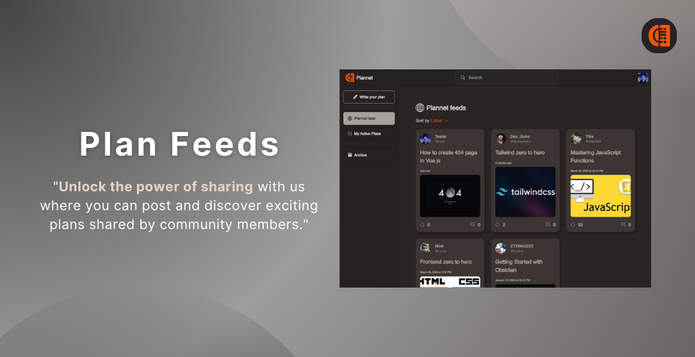</td>
<td>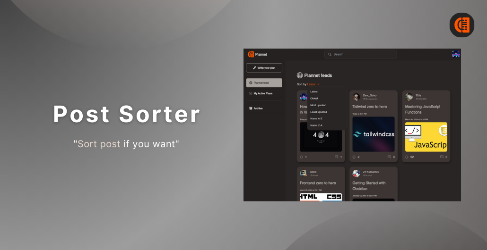</td>
<td>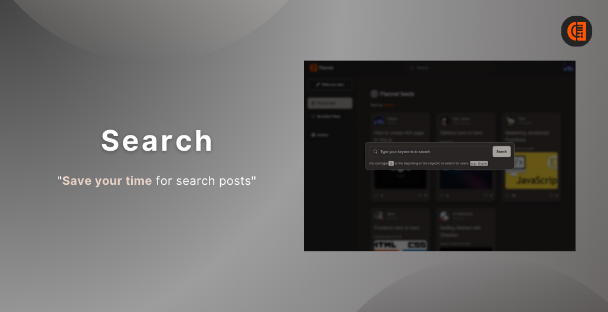</td>
<td>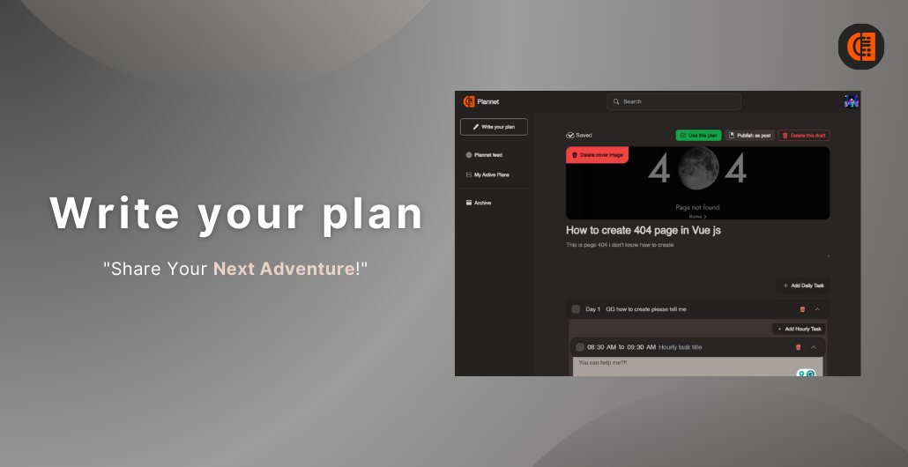</td>
<td>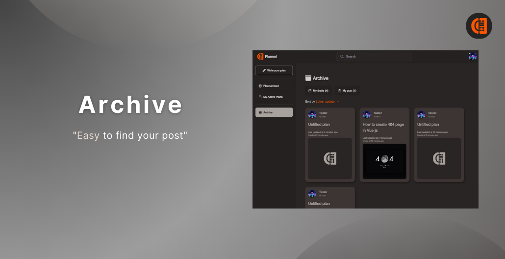</td>
<td>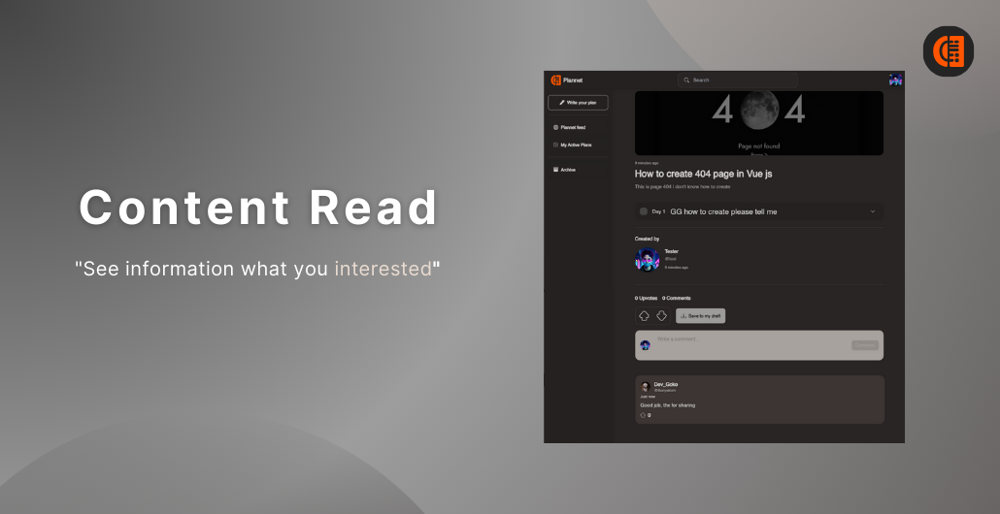</td>
<td>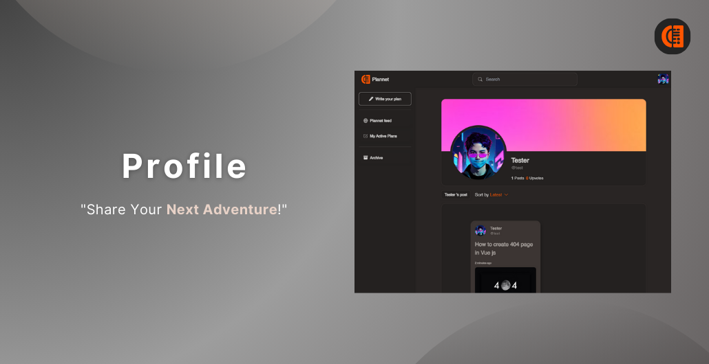</td>
<td>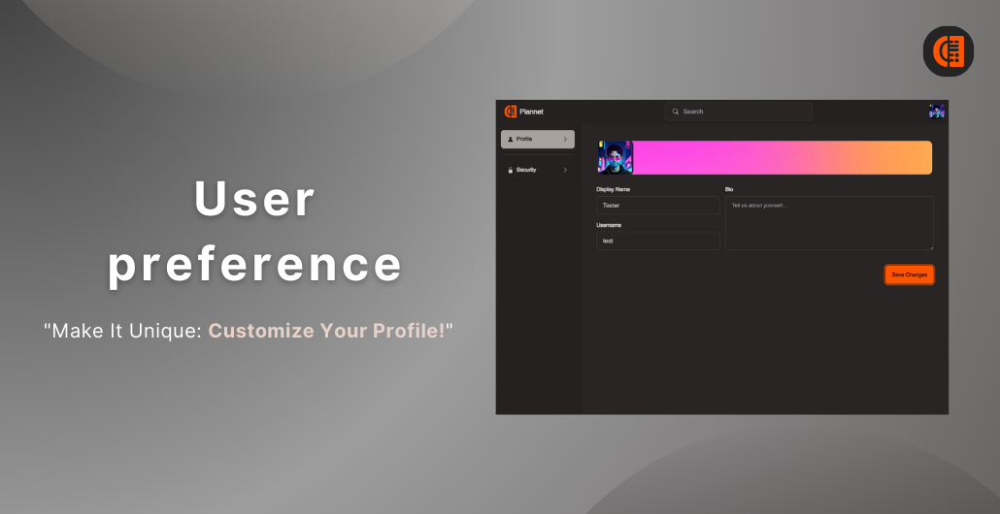</td>
<td>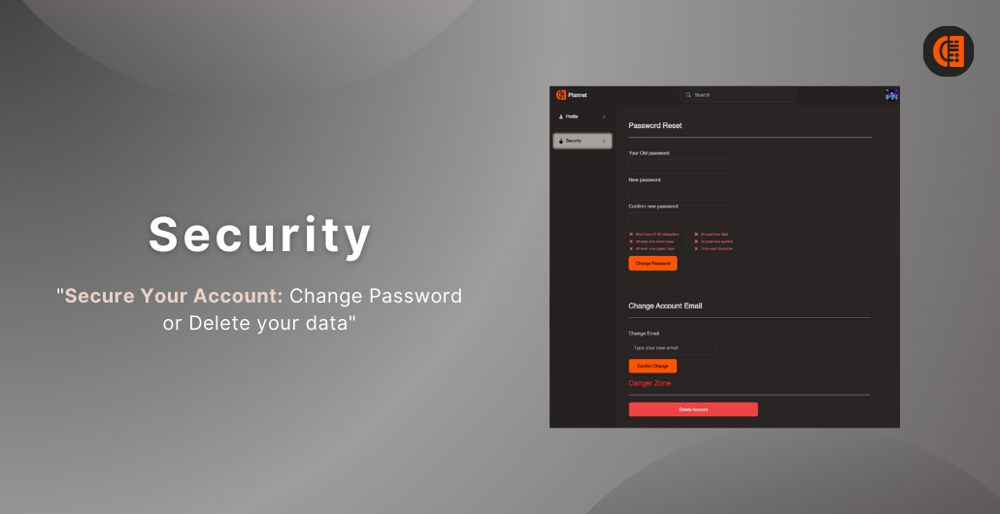</td>
<td>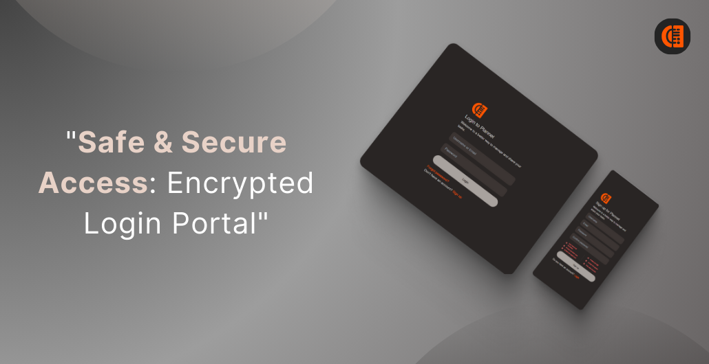</td>
<td>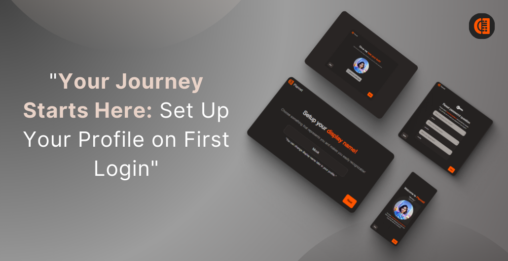</td>

# Responsive design

 <table align="center">
    <tbody>
      <tr>
        <td align="center">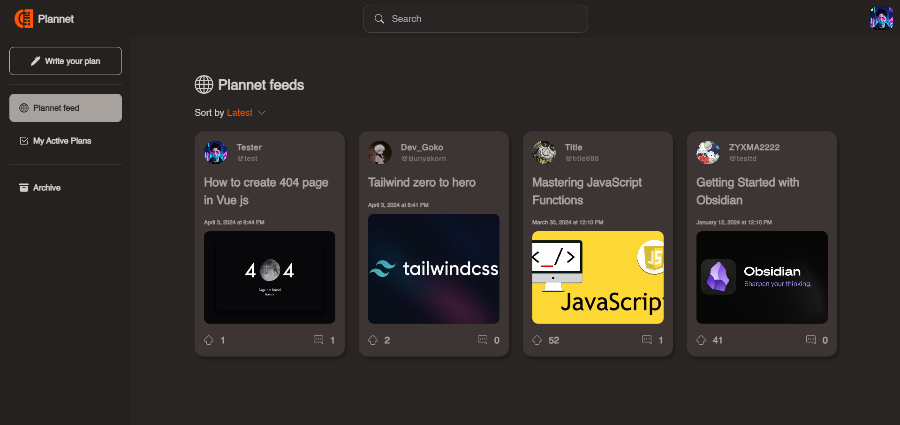</td>
        <td>PC</td>
      </tr>
      <tr>
        <td align="center">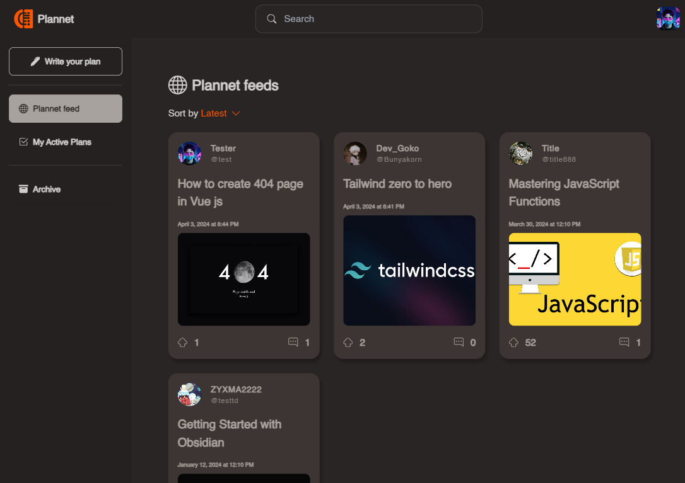</td>
        <td>Tablet</td>
      </tr>
      <tr>
        <td align="center">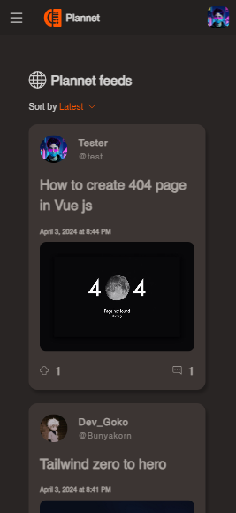</td>
        <td>Mobile</td>
      </tr>
    </tbody>
  </table>

# How to use ?

# References

- **Design**

    - [Daily.dev (Ui design reference)](https://daily.dev/)
    - [Github (Ui user perference reference)](https://github.com/)
    - [Google (Ui setup account reference)](https://www.google.com/)
    - [Facebook (Ui profile reference)](https://www.facebook.com/)
    - [Pinterest (Ui sidebar reference)](https://www.pinterest.com/pin/1125968649043608/)
    - [Skiff (Ui login page reference)](https://skiff.com/)
    - [Notion (Ui edit post)](https://www.notion.so/) 

 

